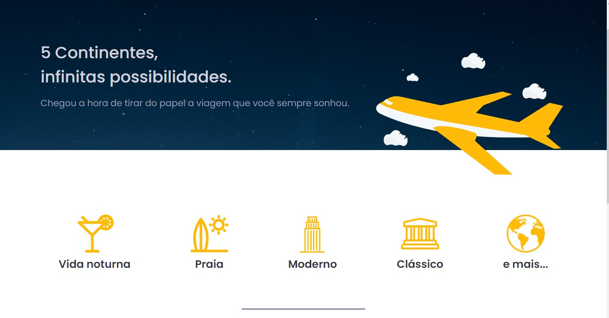

  

<h2 align='left'> 👨‍💻 Sobre o app </h2>

 Aplicação desenvolvida utilizando Typescript, NextJS e Chakra-UI. Design compartilhado pelo Ignite da Rocketseat 
 
<h2 align="left"> ✨ Tecnologias utilizadas: </h2>
<li> Chakra-UI </li>
<li> Typescript </li>
<li> NextJS </li>